# Qubik - Timer Profesional para Speedcubing

## 1. Descripción general del proyecto

Qubik Timer es una aplicación web diseñada para la práctica formal de speedcubing bajo condiciones equivalentes a las de competencia. El speedcubing consiste en resolver un cubo Rubik en el menor tiempo posible siguiendo combinaciones oficiales y registrando cada intento para analizar el rendimiento mediante métricas estadísticas reglamentadas.

<p align="center">
  
  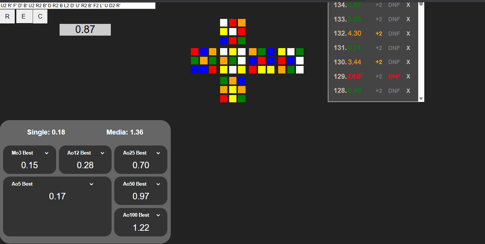
</p>

La aplicación reproduce ese flujo competitivo completo dentro de un entorno digital. Genera combinaciones válidas, mide el tiempo de cada resolución con lógica de activación controlada, registra cada solución en almacenamiento persistente y calcula estadísticas oficiales que se actualizan en tiempo real. Cada nuevo registro impacta inmediatamente en los promedios visibles sin necesidad de recargar la aplicación. El sistema está pensado no solo como cronómetro, sino como entorno integral de entrenamiento y análisis de desempeño.

---

## 2. Tecnologías utilizadas y fundamentos técnicos

Qubik Timer está desarrollado íntegramente en JavaScript Vanilla (ES Modules), sin frameworks ni librerías externas de interfaz. Esta decisión responde a un enfoque arquitectónico orientado al control total del flujo de datos, la manipulación explícita del DOM y la separación estricta de responsabilidades por módulos. La aplicación se organiza en capas lógicas (core, scrambler, database, averages, UI), manteniendo un único punto de entrada y evitando múltiples dependencias implícitas.

El modelo del cubo, el generador de combinaciones, el cronómetro competitivo y el sistema de estadísticas reglamentadas están implementados mediante lógica algorítmica propia. No se utilizan motores gráficos ni librerías matemáticas externas; toda la simulación se basa en estructuras indexadas y transformaciones deterministas de estado.

<p align="center">
  
  
</p>

Para la persistencia se utiliza IndexedDB, la base de datos nativa del navegador orientada a almacenamiento estructurado y de gran volumen. El sistema define dos object stores principales:

* cube3x3: almacena cada solve con su tiempo, scramble, fecha y estados de penalización.
* promDB: almacena la configuración persistente de las métricas Average of X (actual/best).

---

## 3. Modelado lógico del cubo 3x3

El sistema implementa un modelo matemático de un cubo Rubik 3x3 representado visualmente en 2D desde una única perspectiva fija: blanco arriba y verde al frente. Esta orientación corresponde al estándar utilizado en competiciones oficiales para aplicar las combinaciones.

Aunque la representación es bidimensional, la lógica interna replica de forma exacta el comportamiento físico de un cubo tridimensional real. Cada sticker está representado mediante clases que indican su color. Internamente, el cubo no se manipula como una imagen, sino como una estructura indexada donde cada posición representa un sticker específico.

<p align="center">
  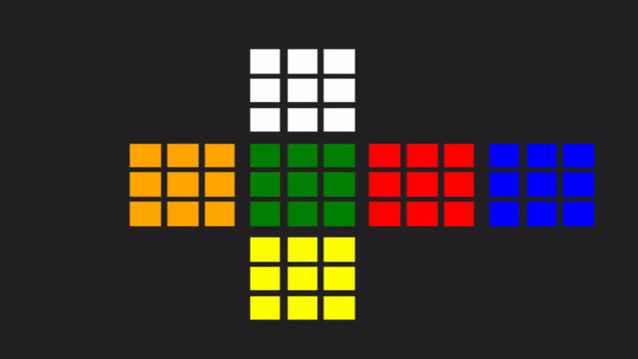
</p>

Las funciones de movimiento operan sobre índices que representan posiciones concretas dentro de esa estructura. Cuando se ejecuta un movimiento —R, L, U, D, F, B y sus variantes inversas o dobles— el sistema intercambia matemáticamente las clases de color entre los índices correspondientes. Esto simula la rotación real de la cara seleccionada y de las capas adyacentes afectadas por el giro.

Como resultado, el estado lógico del cubo siempre es consistente con las reglas físicas de un cubo real. No existen simplificaciones visuales desconectadas del modelo interno; cada render corresponde exactamente al estado matemático actual.

---

## 4. Generación de combinaciones limpias

La combinación se genera mediante un algoritmo que produce entre 20 y 23 movimientos aleatorios, alineándose con los estándares utilizados en entornos competitivos.

El generador no produce secuencias arbitrarias sin restricciones. Incorpora reglas específicas para evitar patrones redundantes o algebraicamente simplificables. Por ejemplo, evita combinaciones como R R (equivalente a R2), L L L (equivalente a L’) o patrones de capas paralelas como R L R (equivalente a R2 L) que pueden reducirse mediante simplificación matemática.

Estas restricciones garantizan que cada combinación sea limpia, no reducible y representativa de un entorno competitivo real. El objetivo es mantener integridad técnica y evitar mezclas artificialmente débiles.

<p align="center">
  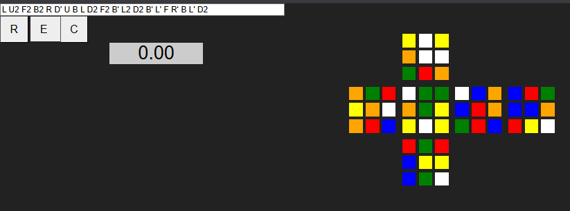
</p>

La combinación generada se inserta en un input que analiza cada movimiento en tiempo real. Cada instrucción válida se ejecuta inmediatamente sobre el render del cubo. El cubo siempre parte de un estado completamente armado, y únicamente los movimientos válidos presentes en el input modifican su estado lógico y visual.

---

## 5. Sincronización entre entorno digital y físico

El usuario ejecuta la combinación mostrada en su cubo físico siguiendo la notación oficial. El objetivo es que el cubo real quede en la misma configuración que el render de la aplicación.

Esta sincronización asegura coherencia entre el entorno físico y el digital. El sistema no resuelve el cubo automáticamente ni simula resultados; reproduce el contexto real de entrenamiento competitivo donde el usuario interactúa con su propio cubo mientras el sistema registra el desempeño.

<p align="center">
  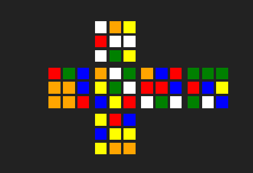
  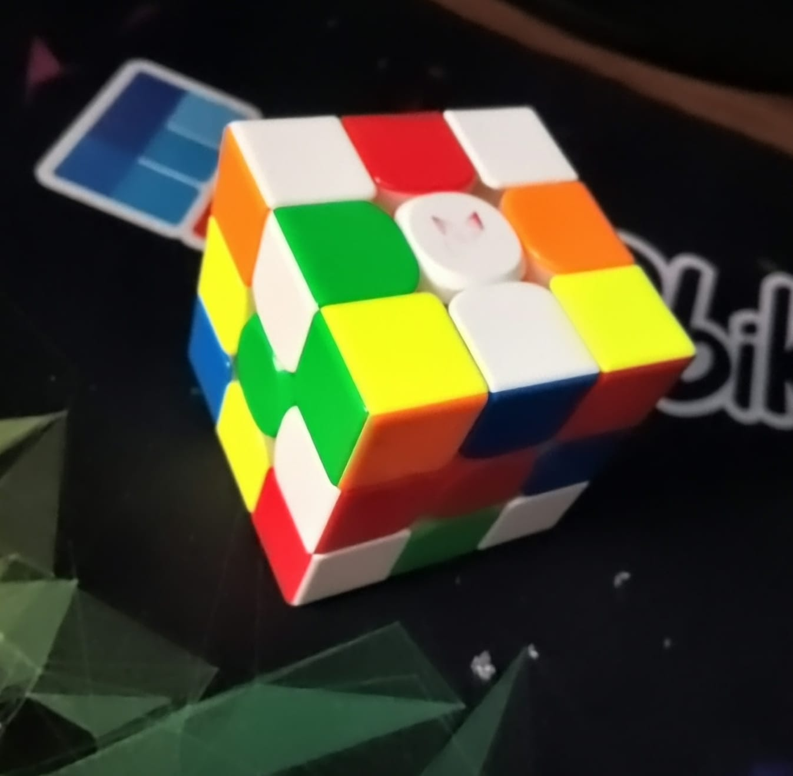
</p>

---

## 6. Controles de gestión de la combinación 

La interfaz incorpora dos controles principales para gestionar el estado del cubo y la mezcla activa.

El botón R (Reiniciar) devuelve el cubo a su estado completamente resuelto y genera automáticamente una nueva combinación. Esta combinación se inserta en el input y se ejecuta inmediatamente para renderizar la nueva configuración.

<p align="center">
  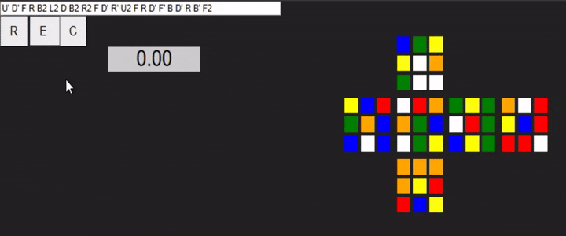
</p>

El botón E (Editar) permite modificar manualmente la secuencia de movimientos. Cualquier cambio válido en el input se refleja en tiempo real en el estado lógico y visual del cubo. Esto permite análisis de casos específicos, pruebas técnicas o estudio de situaciones particulares.

<p align="center">
  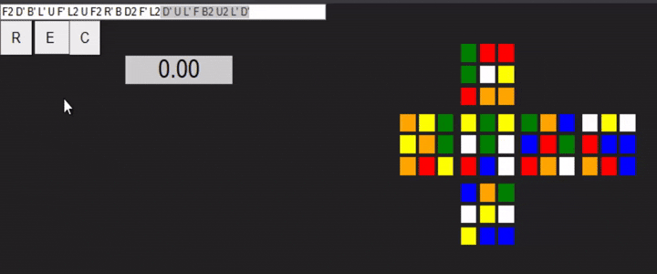
</p>

El botón C (Copiar) copia al portapapeles la combinación actualmente activa en notación oficial. Su función es permitir que el usuario pueda reutilizar la mezcla fuera de la aplicación, ya sea para compartirla, registrarla en otro entorno, repetir una misma situación en múltiples sesiones o analizarla con herramientas externas.

---

## 7. Cronómetro con lógica de competencia

El sistema incorpora un cronómetro diseñado siguiendo la lógica utilizada en competiciones oficiales.

Para iniciarlo, el usuario debe mantener presionada la barra espaciadora durante al menos 300 milisegundos y luego soltarla. Este retraso intencional evita activaciones accidentales y simula el comportamiento de timers físicos de competencia.

<p align="center">
  
</p>

El tiempo comienza al soltar la tecla y continúa hasta que se vuelve a presionar la barra espaciadora para detenerlo. Al finalizar la medición, el cubo regresa automáticamente a su estado resuelto y se genera un nuevo scramble para la siguiente resolución. Esto mantiene un flujo continuo de entrenamiento sin reinicios manuales adicionales.

---

## 8. Registro estructurado de cada solución

Cada vez que el cronómetro se detiene, se construye una estructura de datos que representa formalmente la solve realizada. Esta estructura incluye el tiempo obtenido, el scramble utilizado, la fecha en formato en-US, el tipo de cubo y dos posibles estados de penalización: +2 y DNF.

```js
	let solve = {

	time: cronometro.textContent,
	scramble: notacion.value,
	date: new Date().toLocaleString('en-US', { 
		month: 'long', 
		day: '2-digit', 
		year: 'numeric', 
		hour: 'numeric', 
		minute: '2-digit', 
		hour12: true 
	}),
	dnf: false,
	masDos: false,
	timeMasDos: Number(cronometro.textContent)+2,
	timeDNF: "DNF",
	typeCube:"3x3"
};
```

La penalización +2 se aplica cuando el cubo está resuelto pero requiere un movimiento adicional menor; en ese caso, se suman dos segundos al tiempo registrado. La penalización DNF (Did Not Finish) se aplica cuando el cubo no está correctamente resuelto y requiere más de un movimiento para completarse.

Por defecto, ambas penalizaciones se inicializan en false. Todos estos datos se almacenan en IndexedDB dentro de un object store llamado cube3x3, garantizando persistencia local y funcionamiento offline.

---

## 9. Renderizado inmediato y gestión de penalizaciones

Al guardarse un registro en la base de datos, este se renderiza inmediatamente en una tabla del frontend. Cada fila muestra el tiempo y dispone de controles para aplicar +2, DNF o eliminar la resolución.

Si se aplica +2, el tiempo aumenta en dos segundos tanto en el frontend como en la base de datos y cambia visualmente a color naranja. Si se aplica DNF, el tiempo pasa a mostrarse como “DNF”, cambia a color rojo y el campo correspondiente en la base de datos se actualiza a true. El botón de eliminación elimina el registro tanto del frontend como del storage cube3x3.

<p align="center">
  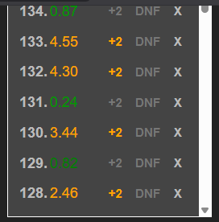
  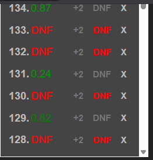
</p>

Todos estos cambios impactan automáticamente en las estadísticas visibles, ya que el sistema recalcula las métricas en tiempo real tras cualquier modificación.

---

## 10. Overlay detallado por solución

Cada tiempo registrado puede seleccionarse. Al hacerlo, se abre un overlay que muestra una vista detallada de la solución almacenada en la base de datos. Esta vista incluye el tiempo registrado, la fecha, el tipo de cubo, la combinación en notación oficial y un render del estado correspondiente.

<p align="center">
  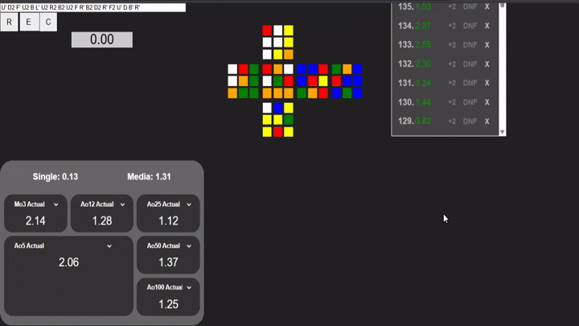
</p>

Desde este overlay también pueden aplicarse penalizaciones, copiar el scramble, cerrar la vista o eliminar la resolución. Cualquier acción realizada se sincroniza inmediatamente con la base de datos y con el frontend, manteniendo coherencia total entre estado visual y persistencia.

---

## 11. Sistema de estadísticas reglamentadas

La sección de estadísticas contiene 8 métricas principales implementadas bajo reglas formales.

Mo3 calcula la media directa de 3 tiempos consecutivos y no permite ningún DNF; si existe 1, el resultado es DNF.

Ao5 utiliza 5 tiempos, elimina el mejor y el peor y promedia los 3 restantes. Permite como máximo 1 DNF; si hay más, el resultado es DNF.

Ao12 utiliza 12 tiempos, elimina el mejor y el peor y promedia los 10 restantes, con un límite de 1 DNF.

Ao25 elimina los 2 mejores y los 2 peores tiempos de un conjunto de 25 y promedia los 21 restantes, permitiendo hasta 2 DNFs.

Ao50 elimina 3 mejores y 3 peores tiempos y promedia 44, con un límite de 3 DNFs.

Ao100 elimina 5 mejores y 5 peores tiempos y promedia 90, con un límite de 5 DNFs.

Single representa el mejor tiempo individual registrado en la base de datos, excluyendo cualquier DNF.

La Media calcula el promedio global de todos los tiempos almacenados. El límite de DNF es dinámico y depende del número total de registros. Si existen menos de 100 tiempos, se aplica la lógica de la estadística inmediatamente superior más cercana. Por ejemplo, con 30 tiempos se utiliza la lógica de Ao50. 52 tiempos se toman como referencia como un bloque equivalente a Ao75 con 4 DNFs, aunque no se muestre en el frontend, ya que se usa únicamente para cálculo interno. Cuando el total supera los 100 tiempos, el límite de DNF se acumula por bloques; por ejemplo, con 230 tiempos se suman dos bloques de 100 (5 + 5 DNFs) y un bloque de 50 (3 DNFs), dando un límite total de 13 DNFs.

<p align="center">
  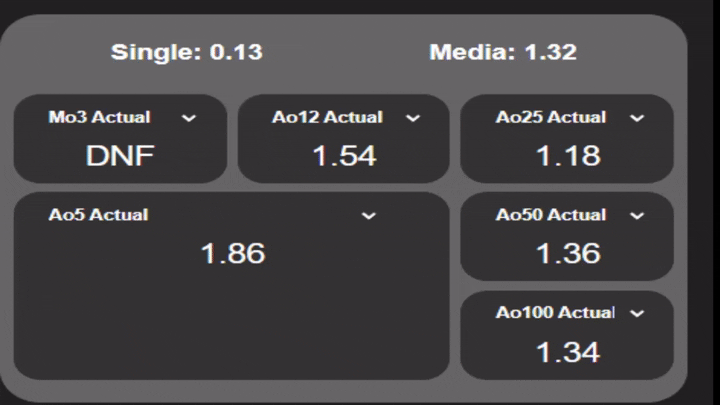
</p>

Todas las estadísticas se recalculan automáticamente en tiempo real tras cualquier cambio en los registros.

---

## 12. Average of X: actual vs best

Las estadísticas Average of X incluyen un selector que permite alternar entre “actual” y “best”. El modo actual muestra el promedio calculado con los últimos X tiempos registrados. El modo best muestra el mejor promedio histórico de X tiempos existente en la base de datos.

<p align="center">
  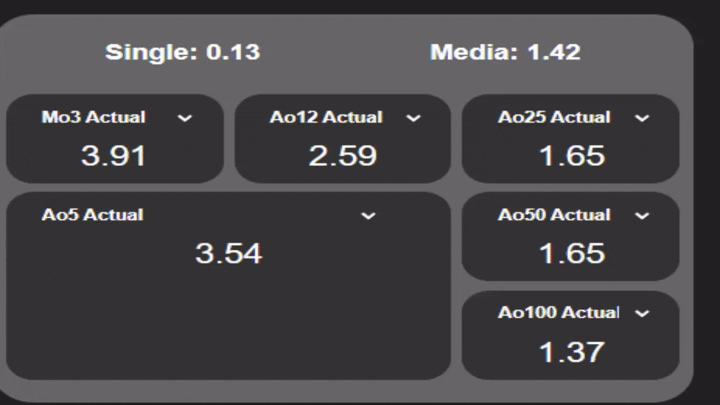
</p>

La preferencia seleccionada se guarda en un segundo object store de IndexedDB llamado promDB. Esto permite que, al reiniciar la aplicación, cada estadística conserve la configuración elegida previamente.

---

## 13. Sistema de flujo de datos, persistencia y funcionamiento offline

El sistema implementa un flujo de datos secuencial donde la base de datos actúa como fuente única de verdad. Cada acción relevante —registro de tiempo, aplicación de penalización o eliminación— sigue el mismo patrón estructural para garantizar coherencia entre almacenamiento, tabla de tiempos, tarjeta de solución y estadísticas.

Cuando el cronómetro se detiene, se construye el objeto *solve* con todos sus atributos: tiempo base, combinación activa, fecha y estados de penalización inicializados (`masDos: false`, `dnf: false`). Este objeto se guarda inmediatamente en IndexedDB dentro del object store `cube3x3`. Solo tras confirmarse la escritura se ejecuta el proceso de renderizado.

Primero se actualiza la tabla de tiempos insertando la nueva solve vinculada a su identificador persistido. Luego se renderiza o actualiza la tarjeta de la solve seleccionada. Finalmente, el sistema recalcula todas las estadísticas utilizando exclusivamente los datos almacenados en la base de datos, evitando cálculos basados en estados temporales del frontend.

Las penalizaciones (+2 y DNF) reinician el mismo flujo. Cuando se aplican, el registro correspondiente se actualiza directamente en IndexedDB modificando sus propiedades internas (`masDos`, `dnf` y, si aplica, el tiempo ajustado). Estos valores se almacenan como `true` o `false` en la base de datos, garantizando persistencia real del estado. Una vez confirmada la actualización, la modificación se refleja simultáneamente en la tabla de tiempos, en la tarjeta de la solución y en el recálculo completo de estadísticas. De este modo, la penalización no es solo visual, sino estructural y persistente.

<p align="center">
  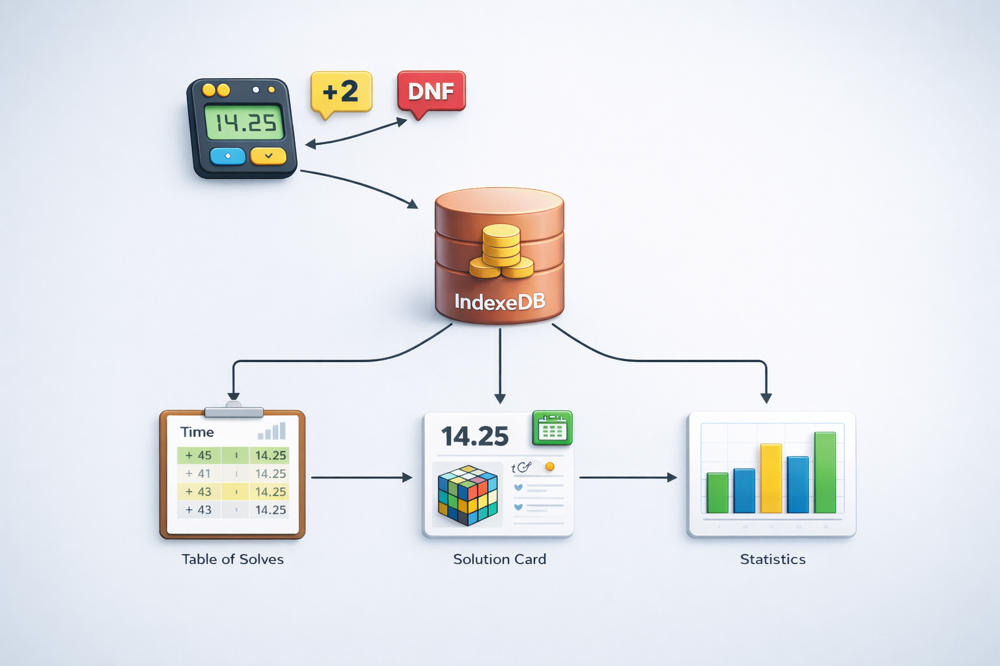
</p>

Tanto `cube3x3` como `promDB` se almacenan de forma persistente en IndexedDB, lo que permite conservar tiempos, penalizaciones y métricas incluso después de cerrar o reiniciar la aplicación. Al iniciarse nuevamente, el sistema reconstruye el estado completo leyendo desde la base de datos y recalculando las estadísticas necesarias.

La arquitectura sigue un enfoque *offline-first*, sin dependencia de servicios externos para su funcionamiento principal, garantizando continuidad operativa y consistencia de datos en todo momento.

---

## 14. Estado actual y proyección

El proyecto se encuentra en etapa activa de construcción. La lógica principal está completamente implementada y funcional, incluyendo modelo matemático del cubo, generador de combinaciones con restricciones, sistema de cronometraje competitivo, persistencia robusta y estadísticas reglamentadas en tiempo real.

Actualmente deben pulirse aspectos visuales como overlays de estadísticas y diseño general antes de su lanzamiento formal. La primera versión estará orientada exclusivamente a escritorio y centrada en el cubo 3x3. Posteriormente, el sistema escalará incorporando nuevos tipos de cubos, estadísticas más personalizables y adaptación completa para dispositivos móviles.

## 15. Autor

**Emanuel Orjuela Barbosa**

Correo: [emanuelorjuelabarbosa12@gmail.com](mailto:emanuelorjuelabarbosa12@gmail.com)

Instagram: [https://www.instagram.com/qubik_timer](https://www.instagram.com/qubik_timer)

Github: [https://github.com/Emanuelorjuela](https://github.com/Emanuelorjuela)

Qubik Timer está concebido como una herramienta de práctica competitiva y, al mismo tiempo, como demostración de arquitectura frontend modular, modelado matemático complejo y gestión avanzada de almacenamiento local en JavaScript puro.

